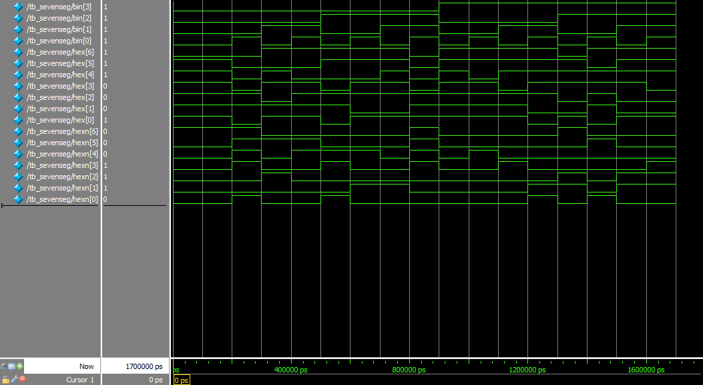

# Assignment 01
*Implementing HDL for a 1-digit 7-segment display*

**This document and code are also available on my [GitHub repo](https://github.com/jake-is-ESD-protected/learn_HDL/tree/master/assignments/a01) and made with the VScode "md to pdf" extension**

## Information

This small system verilog project shows how to implement the first step of a 1-digit 7-segment display as close to hardware as possible.

>*"it doesn't get deeper than this..."*

## About [sevenseg](sevenseg/src/sevenseg.sv)

Here the central I/O module gets initialized. It contains the LUT used to make decisions about the visual display of digital data. Since the wiring of the 7SD is manmade, it follows no particular mathematical rule, which means that an automation is impossible. Therefore, a 1:1 LUT is the best way to achieve a direct mapping between a 4bit interger input and a 7bit display. Additionally, it creates the negated output in every case. This makes the code long but readable and the numbers 0 to 15 only get mentioned once.

## About [tb_sevenseg](sevenseg/sim/tb_sevenseg.sv)

The testbench stimulates the module with all requested numbers (hex 0 to F). For this, it maps all I/Os to the testbench I/Os and displays them in text form (and of course as waves in the model-sim). To fill the input, a for-loop is utilized.

## About [sim_tb_sevenseg](sevenseg/sim/sim_tb_sevenseg.tcl)

This is the starting script for the model-sim software. In here standard procesdures are followed through according to the lecture of 14.10.21. Calling it from the model-sim software causes the simulation to start and waveforms to be displayed.

## Results

Two kinds of results can be obtained from the simulation:
1. The coded output via ```$dispay```
2. The waveforms from the simulation

It has to be stated that these waveforms do not visually tell much about the 7SD since they are not arranged like a 7SD display. The verification of data is therefore a quite on-the-nose one and has to be checked by a human.

### Console out:
```
# ***********************
# Benching sevenseg...
# ***********************
#  0 --> 3f != 40
#  1 --> 06 != 79
#  2 --> 5b != 24
#  3 --> 4f != 30
#  4 --> 66 != 19
#  5 --> 6d != 12
#  6 --> 7d != 02
#  7 --> 07 != 78
#  8 --> 7f != 00
#  9 --> 6f != 10
# 10 --> 77 != 08
# 11 --> 7c != 03
# 12 --> 39 != 46
# 13 --> 5e != 21
# 14 --> 79 != 06
# 15 --> 71 != 0e
# ***********************
# sevenseg benching end.
# ***********************
```

### Waveforms:



The waveforms correspond to the desired output and negated output with the segment 0 (on top of the digit) being the LSB and the center segment the MSB. 