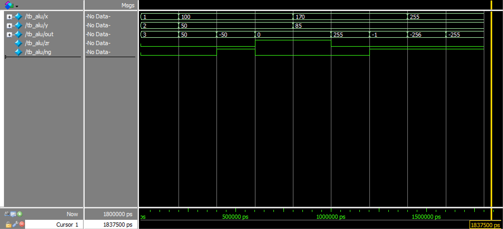

# Assignment 02
*Implementing HDL for a general 16bit ALU*

**This document and code are also available on my [GitHub repo](https://github.com/jake-is-ESD-protected/learn_HDL/tree/master/assignments/a02) and made with the VScode "md to pdf" extension**

## Information:

>*"one plus one plus one plus not one plus one..."*

## About [alu](alu/src/alu.sv):

This code describes every single operation devised by an ALU. It does so by receiving two 16bit inputs, `x` and `y`. What shall be computed is up to 6 controlling inputs which are of 1bit logic nature. Setting them in the right order produces more "complex" arithmetic functions such as subtraction, OR and and negation as opposed to the two standard operations addition and logic AND. This is decided by an if-chain which first operates directly on `x` and then `y`. After that, the operation of `+` or `&` is chosen. After this, the output is computed and the output flags are set accordingly to indicate if the output is positive, 0 or negative. Despite its scalable abilities, an ALU is quite simple to realize.

## About [tb_alu](alu/sim/tb_alu.sv):

The testbench combines all 6 command inputs to a command bus `c`. It contains a bit-sequence representing the operations as described in the task. These sequences are defined as macros which describe their behavior in their name, quite comfortable. A macro might look like this:
```
`BIN_OR 6'b101010
``` 
In this case, the oring of two values is requested. If `x` and `y` are given, the ALU computes `out = x | y`.

### Example:
```
x = 0xaa    // = 0b10101010
y = 0x55    // = 0b01010101
out = x | y = 255 // | is 0b101010, 255 = 11111111
```
This means that the following cmd-bits are set: `nx, ny, no`. Therefore, the program flow should be:
1. invert x
2. invert y
3. x AND y
4. invert output

>Why?

DeMorgan's law states that a negated OR is equal to the AND of two negated values. By then again inverting the output an OR can be derived from two ANDs

All requested opeartions are computed, self-checked and printed on the terminal (see "Results").

## About [sim_tb_alu](alu/sim/sim_tb_alu.tcl):

Standard .tcl-script for a simple model-sim. 

## Results:

### Console out:

```
# start ALU...
# waiting for self-check:
# 
# addition:
# x =     1, y =     2, 
# no = 0, f = 1, ny = 0, nz = 0, nx = 0, zx = 0
# out =     3, zr = 0, ng = 0
# 
# subtraction to pos int:
# x =   100, y =    50, 
# no = 1, f = 1, ny = 0, nz = 0, nx = 1, zx = 0
# out =    50, zr = 0, ng = 0
# 
# subtraction to neg int:
# x =   100, y =    50, 
# no = 1, f = 1, ny = 1, nz = 0, nx = 0, zx = 0
# out =    -50, zr = 0, ng = 1
# 
# setting to 0:
# x =   100, y =    50, 
# no = 0, f = 1, ny = 0, nz = 1, nx = 0, zx = 1
# out =     0, zr = 1, ng = 0
# 
# anding of hex vals:
# x =   170, y =    85, 
# no = 0, f = 0, ny = 0, nz = 0, nx = 0, zx = 0
# out =     0, zr = 1, ng = 0
# 
# oring of hex vals:
# x =   170, y =    85, 
# no = 1, f = 0, ny = 1, nz = 0, nx = 1, zx = 0
# out =   255, zr = 0, ng = 0
# 
# setting output to -1:
# x =   170, y =    85, 
# no = 0, f = 1, ny = 0, nz = 1, nx = 1, zx = 1
# out =     -1, zr = 0, ng = 1
# 
# setting output to !255:
# x =   255, y =    85, 
# no = 1, f = 0, ny = 1, nz = 1, nx = 0, zx = 0
# out =   -256, zr = 0, ng = 1
# 
# setting output to -255:
# x =   255, y =    85, 
# no = 1, f = 1, ny = 1, nz = 1, nx = 0, zx = 0
# out =   -255, zr = 0, ng = 1
# 
# 
# ***************************************************
# Selfcheck report: SUCCESS: 0 errors reported.
# ***************************************************
```

### Waveforms:



## Afterword
The mentioned procedures were chosen for specific reasons. The inner works of the ALU were programmed in close relation with the requirements in the task, as they are written there in pseudo-code. The testbench however employs certain busses for easier handling of signals. Another aspect of dichotomy of procedures is the error handling. The code asserts certain states for every requested calculation in exactly the same manner as the one before it but with different inputs and commands. This makes the code easy to understand but it has multiple occurrences of similar lines. In the future, testbenches will employ functions to further sophisticate the code.

>*Jakob T., 28.10.21*