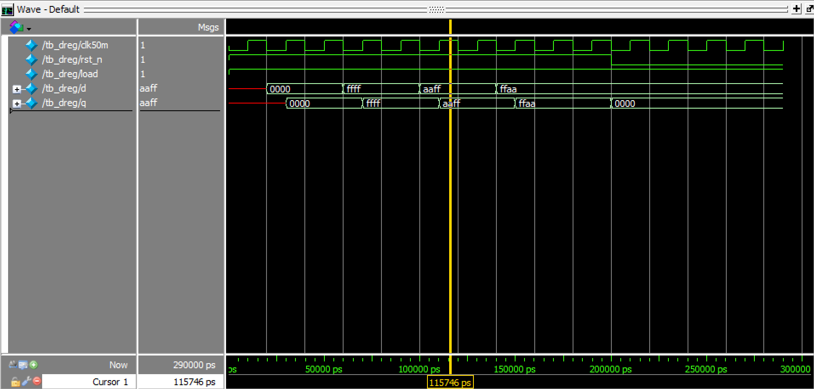
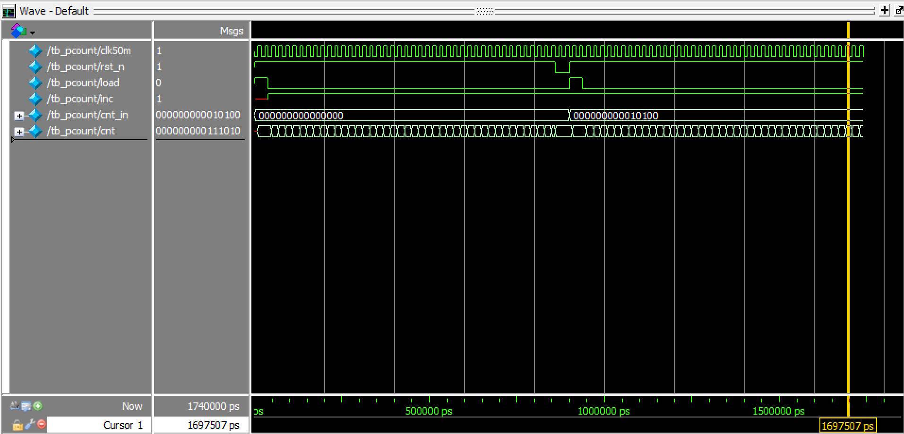
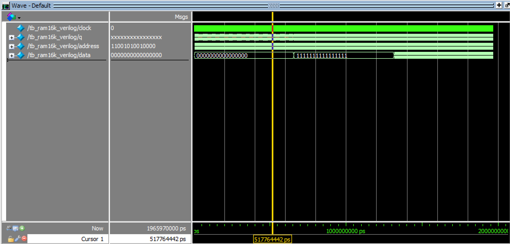

# Assignment 03
*Implementing HDL for MCU memory and program counter*

**This document and code are also available on my [GitHub repo](https://github.com/jake-is-ESD-protected/learn_HDL/tree/master/assignments/a03) and made with the VScode "md to pdf" extension**

## Information:

>*"9 of 10 Doctors recommend putting on flipflops to never forget anything anymore."*

## About [dreg](seq/src/dreg.sv):
This program describes a simple array of 16 D-FFs which together form a 16bit register. Data can be written and read during positive clock edges and reset asynchronously. The output `q` is dependent on the inputs. It stays the same until new data from `d` is written via `load` or the register is reset via `rst_n`.

## About [pcount](seq/src/pcount.sv):
`pcount` is practically the same as `dreg` but with an extra input: `inc`. With this, the counter increments its internal value `cnt` every positive clock edge. Just like the D-FF, the counter can be reset immediately or preloaded with a starting value `cnt_in`.

## About [tb_dreg](seq/sim/tb_dreg.sv):
This testbench checks if data stored in the D-FF stays there over multiple clock cycles. Additionally it writes data like `MAX_VAL` or resets it to `0`. It is important to wait, at least until the next full period offers a new positive edge on which the `load` command can be applied. This is realized by the `@n(egedge clk50m)` command.

## About [tb_pcount](seq/sim/tb_pcount.sv):
The same as above applies to here. However, the mode `inc` causes the timer to act every postive edge, as it should. The timer was interrupted by a reset and is able to start from a custom preload value.

## About [tb_ram16k_verilog](seq/sim/tb_ram16k_verilog.sv):
This testbench activates 16kB of RAM from the already provided `ram16k_verilog.sv` file. While its internal states only take care of one 16bit value the whole memory buffer stores all data. This is why the `assertions` take place in every iteration until the buffer is filled with either all `0`, `1` or every adress contains itself as value. This is done using `for`-loops and incrementing the adress in bits.
>*Zooming in is recommended*

## About [sim_tb_dreg](seq/sim/sim_tb_dreg.tcl):

Standard .tcl-script for a simple model-sim. 

## About [sim_tb_pcount](seq/sim/sim_tb_pcount.tcl):

Standard .tcl-script for a simple model-sim. 

## Results:

### Console out:

```
#################
# Starting D-FF
#################
# 
# Set data to 0:
# q =     0
# Set data to MAX_VAL:
# q = 65535
# Set data to AAFF:
# q = 43775
# Set data to FFAA:
# q = 65450
# Set data to 0 by resetting:
# q =     0
# 
# Self check clean, leaving...

#################
# Starting counter
#################
# 
# increment test:
# cnt =    20
# manual reset:
# cnt =     0
# load preload 20
# cnt =    40
# 
# Self check clean, leaving...

#################
# Starting 16k RAM
#################
# 
# Set all data to 0
# Set all data to 1 (bitwise)
# Set all data to the value of their adress
# 
# Self check clean, leaving...
```

### Waveforms:

`dreg:`


`pcount:`


`ram16k:`


## Afterword

This implementation was very easy to fulfill but leaves me wondering if I forgot anything because it seems to simple to be true. What about overflows? Negative values? These things aren't found anywhere inside of the task. Will this be added in the future or is it compatible by nature? After all, a buffer just stores `1` and `0` and how I interpret them is up to me.

This time, a simple, straight workflow is the best and *IMO* the only way to go. This keeps the testbenches readable and the modules short, since they consist only of a single `always_ff`-block and a short `if`-chain.

>*Jakob T., 04.11.21*