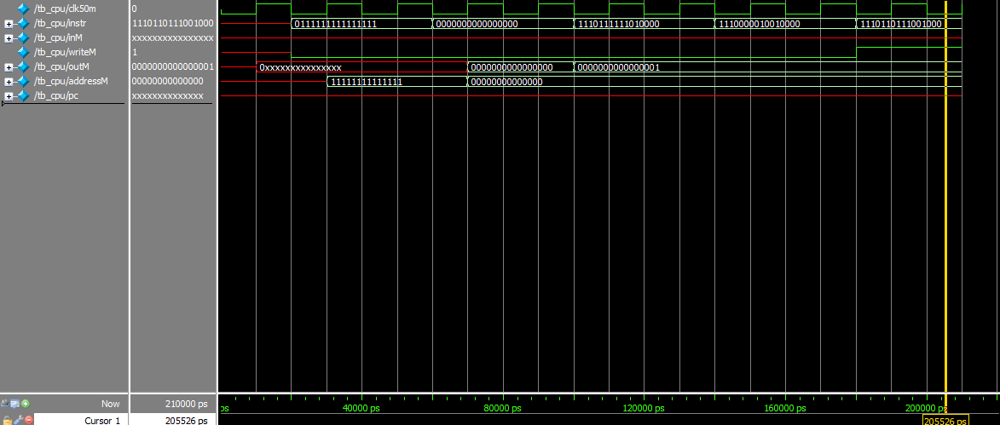

# Assignment 03
*Assembling the HACK-computer's CPU*

**This document and code are also available on my [GitHub repo](https://github.com/jake-is-ESD-protected/learn_HDL/tree/master/assignments/a04) and made with the VScode "md to pdf" extension**

## Information:

>*"Are you done? No. Are you done? No. Are you done? Yes, expect more in 100 nanoseconds..."*

## About [cpu](cpu/src/cpu.sv):
All previously built modules get instanciated here and wired up. For this, every wire mentioned in the figure has to be declared and then carefully "soldered" to all the integral parts of the CPU as shown. This is done in a way to least confuse the developers by creating the needed wires next to the instances of the parts such as the registers, alu, counter, demuxer and jump controler. A bit of additional logic is needed as well. It points the wires into the right direction in cases of `A` and `C` commands, which either store and compute addresses in memory or data.

## About [instr_demux](cpu/src/instr_demux.sv):
The demuxer is responsible for the decoding of the instruction and follows a simple routine:

1. MSB is `0` -> address is requested. MSB is `1` -> data is requested
2. Feed all values of the input except for the MSB through
3. Terminate all demux-outputs in case of the MSB being `0`
4. Control the ALU in case of the MSB being `1`

The demuxer acts as switch between command types.

## About [jmp_ctrl](cpu/src/jmp_ctrl.sv):
This module is deticated only to the `jmp`-bits of the instruction. It evaluates when to jump to a certain address according to the state of other peripherals. In normal operation, it should increment every time a simple line of code is requested. Whenever a function is called, it jumps to the supplied address.

## About [tb_cpu](cpu/sim/tb_cpu.sv):
The testbench evaluates the CPU's immediate reaction to incoming instructions. It has to be noted, that it is not yet connected to memory, which means that certain instructions don't work or react.

The requested 5 instructions show the following nature:
* 2 of them are of type `A`
* 3 of them are of type `C`
* none of them include `jmp`-bits
* all `C` instructions cause the ALU to compute the number `1`

Assertions are done according to this knowledge. The notable outputs are `outM`, as it holds what would be transferred as data, `addressM`, as it contains the desired address and `writeM`, as it shows when data should be written to memory. The output `pc` is never stimulated, as no instructions contain set `jmp`-bits. See figure below for more info.

## About [tb_instr_demux](cpu/sim/tb_instr_demux.sv):
This short testbench asserts the functionality of the demuxer. It gets the same input as the CPU-testbench and acts as the gate to the rest of the CPU. The same values are inserted and tested for their validity.

## About [sim_tb_cpu](cpu/sim/sim_tb_cpu.tcl):

Standard .tcl-script for a simple model-sim. 

## About [sim_tb_instr_demux](cpu/sim/sim_tb_instr_demux.tcl):

Standard .tcl-script for a simple model-sim. 


## Results:

### Console out:

```
#################
# Starting CPU
#################
# 
# Load A to the value 0x7FFF:
# addressM is 11111111111111
# --> Success.
# 
# Load A to the value 0x0000:
# addressM is 00000000000000
# --> Success.
# 
# Set D to 1:
# outM is     1
# --> Success.
# 
# Add D+A and store the result in D:
# outM is     1
# --> Success.
# 
# Increment A and store the result in memory:
# outM is     1
# --> Success.
# 
# 
# Self check clean, leaving...
```

### Waveforms:
`cpu`


>*Comment:* `pc` is not accessed as stated above, and `inM` is not supplied either, since no memory is connected. These tests will follow in the next examples during lecture.

## Afterword
This was a difficult task with many points of faillure and i feel that the requested testbench doesn't put enough stress on the cpu. I don't know how well it will work in the big picture, since so many things can go wrong from now on. Additionally, this testbench supplies me with misleading results. Since every output of the C-instructions is `1`, I first assumed that it was stuck. Why not test for a broader range of values? Of course I can do that myself, but asking for it as mandatory would help assure students in their programming.


>*Jakob T., 22.11.21*