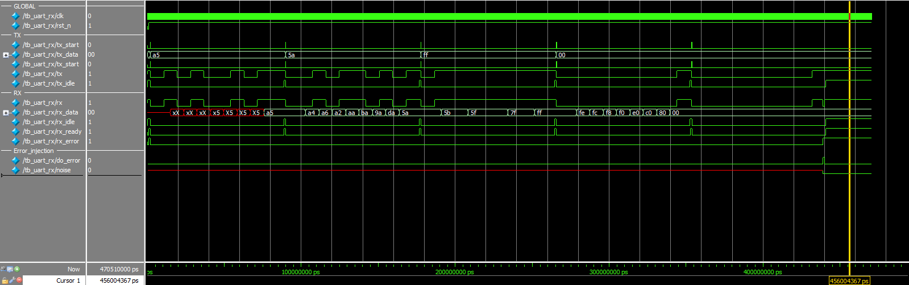

# Assignment 05
*Implementing a working UART reciever*

**This document and code are also available on my [GitHub repo](https://github.com/jake-is-ESD-protected/learn_HDL/tree/master/assignments/a05) and made with the VScode "md to pdf" extension**

## Information:

>*"-- --- .-. . -.-. .- -.- . ..-. --- .-. . ...- . .-. -.-- -... --- -.. -.--" ~ Mr. Henry Uart, probably*

## About [uart_rx](uart_rx/src/uart_rx.sv):
This module features a total of 5 sequential blocks and one combinatorial one which acts as a finite state machine. Similar to the uart-sender it contains states which get switched accordingly to outer flags and signals.

### A short overview over the sequential blocks:
1. State updater for the FSM, acts as clock
2. Bitwidth counter specifies the time of each transmitted bit, it acts as data-clock
3. Bit counter ensures that 8 bit are always read
4. FF for the `rx_ready`-flag
5. FF for the `rx_error`-flag


### A short overview over the FSM:
* The reciver's input is idle-high and does nothing
* A start-bit (`LOW`) pulls the reciver into start-mode
* It initiates a framing timer and a bitcounter (these are dependent on baudrate and wordlenght)
* Before 8 bits are read at the center of each pulse, the FSM enters its `DATA` state again and again.
* As soon as it has counted all bits, it checks for the stop-bit (`HIGH`) and and enters the idle state again.
* If no stop-bit is present or interrupted, the error flag is set.

## About [tb_uart_rx](uart_rx/sim/tb_uart_rx.sv):

The testbench checks if the values are transmitted correctly and if the flags show the right behavior. This is again done by `if`-blocks and careful timing between dataframes. The reoccurring of the `idle`-flag is used to determine wheter another block can be sent or not.

Additionally, a short combinatorial block acts as a switch between two connections: one is the standard `tx`->`rx` connection one might solder or pin together on a microcontroller and peripherals and the other is a purposeful error-injection into the line. By ignoring the regulations of the `uart_tx` asynchronous errors can be injected to check wheter the setting of the error flag works accordingly. In this case, the stop-bit is shortly interrupted by a `LOW` signal, which could indicate a framing error. In such a case, the `rx_error`-flag should be set until the next start of a frame.

## About [sim_tb_uart_rx](uart_rx/sim/sim_tb_uart_rx.tcl):

Standard .tcl-script for a simple model-sim.

## Results:

### Console out:

```
#################
# Starting UART
#################
# 
# Initiate with reset:
# rx_idle = 1, rx_ready = 0, rx_error = 0
# --> Flags correct.
# 
# Transmit 0xA5:
# Flags in transit:
# rx_idle = 0, rx_ready = 0, rx_error = 0
# --> Flags correct.
# Flags after transit:
# rx_idle = 1, rx_ready = 1, rx_error = 0
# sent data: 0xa5. recieved data: 0xa5
# --> Success.
# 
# Transmit 0x5A:
# Flags in transit:
# rx_idle = 0, rx_ready = 0, rx_error = 0
# --> Flags correct.
# Flags after transit:
# rx_idle = 1, rx_ready = 1, rx_error = 0
# sent data: 0x5a. recieved data: 0x5a
# --> Success.
# 
# Transmit 0xFF:
# Flags in transit:
# rx_idle = 0, rx_ready = 0, rx_error = 0
# --> Flags correct.
# Flags after transit:
# rx_idle = 1, rx_ready = 1, rx_error = 0
# sent data: 0xff. recieved data: 0xff
# --> Success.
# 
# Transmit 0x00:
# Flags in transit:
# rx_idle = 0, rx_ready = 0, rx_error = 0
# --> Flags correct.
# Flags after transit:
# rx_idle = 1, rx_ready = 1, rx_error = 0
# sent data: 0x00. recieved data: 0x00
# --> Success.
# 
# Force framing error in stopbit:
# rx_idle = 0, rx_ready = 0, rx_error = 1
# --> Flags correct.
# 
# 
# Self check clean, leaving...
```

### Waveforms:
``


>*Comment 1:* The first time booting up the recieve-buffer is of course undefined, hence the red waves

>*Comment 2:* As can be seen in the last few moments, the stop-bit is interrupted by an unexpected low and the error-flag is set

## Afterword
This was the most sophisticated but also intuitive assignment of them all. This can be implemented in various ways and it will differ between students. What's important is that the sender fits the reciever in all cases. This was a great insight into protocols on a bitwise, hardware level and shows how much brainpower a simple UART-connection uses. 

>*Jakob T., 21.11.21*